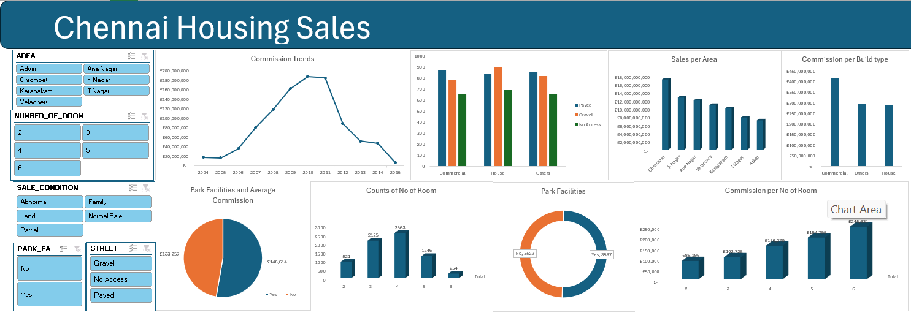
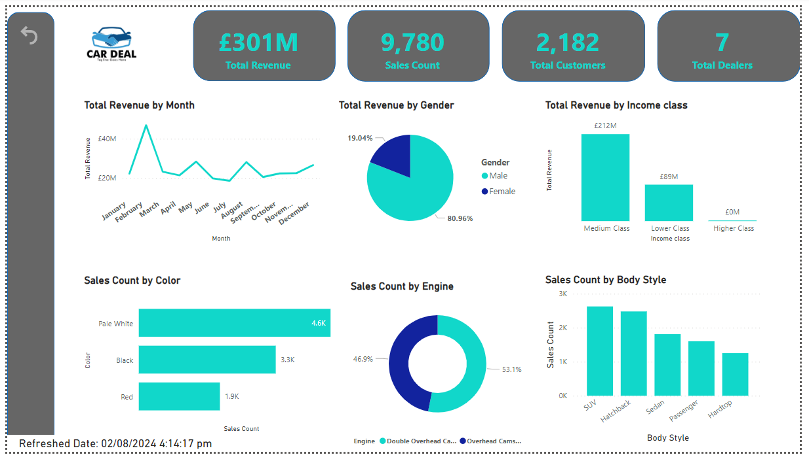
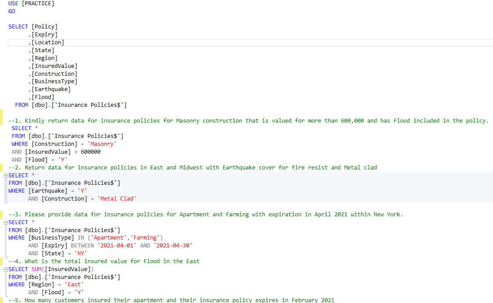
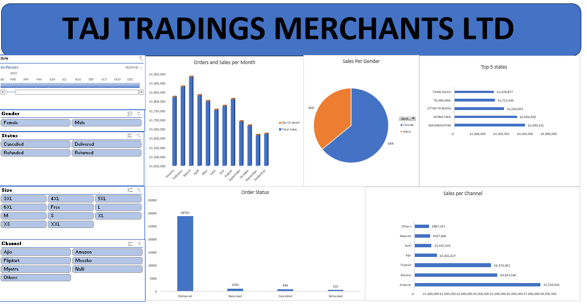
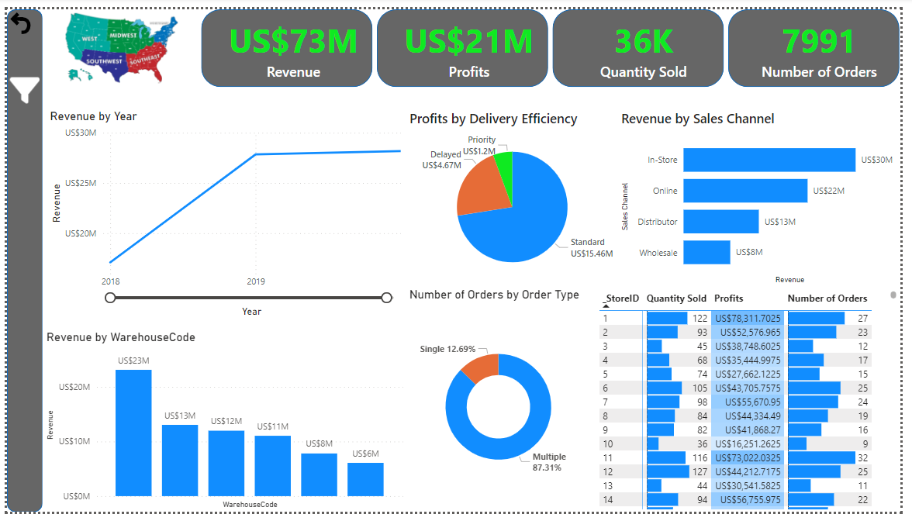
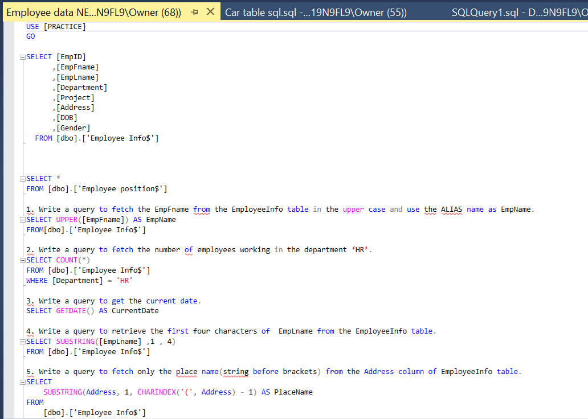
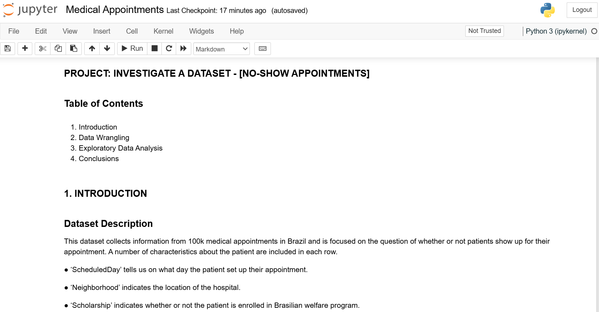
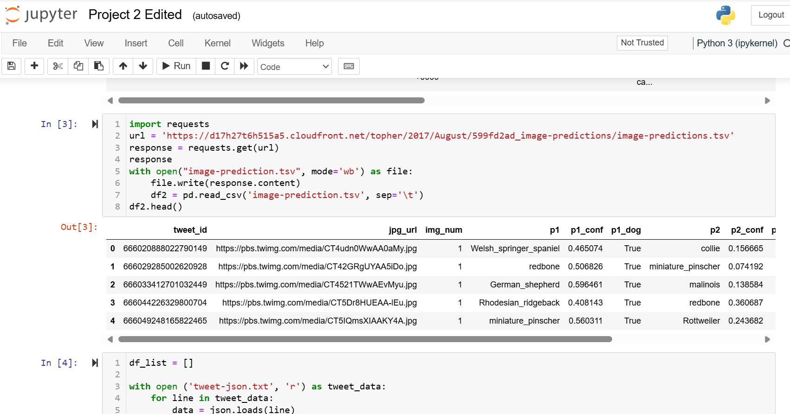
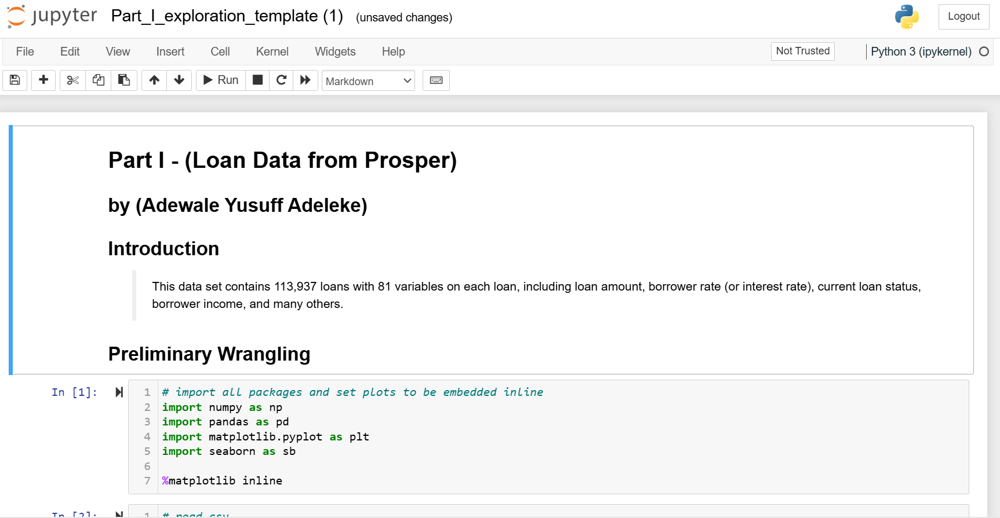
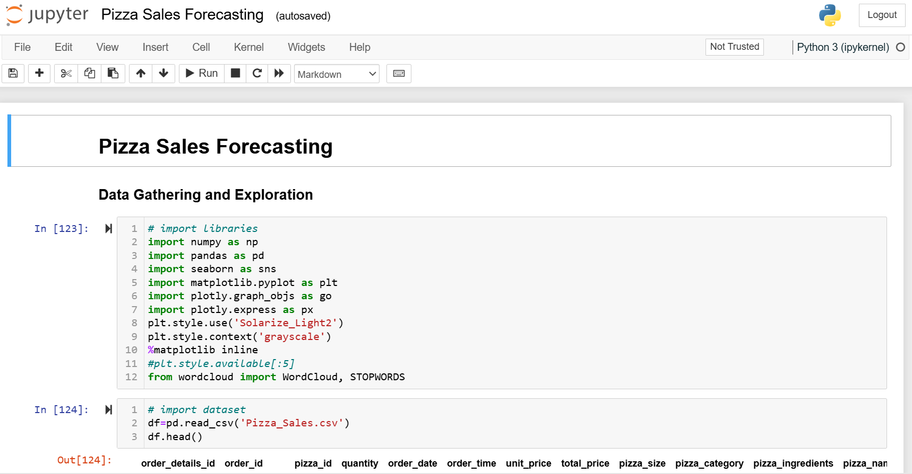

# Project 1
**Title:** [Chennai Housing Sales](https://github.com/bluewales33/bluewales33.github.io/blob/main/Chennai%20houseing%20sale.xlsx)

**Tools Used:** Micrososft Excel (Functions, Pivot Column, Power Query Editor and Vizualization tools)

**Project Descriptions:** This project involve analyzing housing sales data in Chennai. The dataset includes various attributes related to real estate transactions, such as: Area, Number of Rooms, Park Facilities, Build Type, Sale Condition, Date of Sale and Build, Registration Fee, Commission and Registration Fee.

**Key Findings:** 

Area (Total Sales Price by Area)

- High-Value Areas: Certain areas like Chrompet, Adyar, and Velachery might show significantly higher total sales prices, indicating that these are high-demand regions.
- Concentration of Sales: There could be a clear concentration of high-value transactions in specific areas, suggesting these might be more desirable for buyers, possibly due to factors like infrastructure, amenities, or proximity to key locations.

Park (Park Facilities and Sales Correlation)

- Impact of Park Facilities: Properties with park facilities might be associated with higher sales volumes or prices, indicating that access to green spaces is a valued feature for buyers.
- Distribution: If a large percentage of properties either have or do not have park facilities, this could indicate a trend in development or buyer preference in certain areas.

Number of Rooms (Rooms and Average Commission)

- Room Count Correlation: Properties with more rooms could be associated with higher commissions, suggesting a direct correlation between the size of the property and the revenue generated.
- Preference for Larger Homes: If properties with 3 or more rooms dominate the data, it might indicate a preference for larger homes in the Chennai housing market.

Build Type (Build Type, Street Type, and Commission Analysis)

- Commercial vs. Residential: Commercial properties might show different commission patterns compared to residential ones, indicating different profitability levels for real estate agents or developers.
- Street Type Influence: Properties on paved streets could show higher commissions or sales prices, highlighting the importance of infrastructure in real estate valuation.

Dates (Yearly Sales and Commission Trends)

- Yearly Trends: A visible trend in sales prices or commissions over the years could indicate market growth, stagnation, or fluctuations due to economic factors or policy changes.
- Peak Years: Certain years might stand out with unusually high sales or commissions, potentially linked to specific events (e.g., economic booms, new infrastructure projects, or favorable policies).

**The Dashboard Overview:**

# Project 2
**Title:** [Car Sales](https://github.com/bluewales33/bluewales33.github.io/blob/main/car%20powerbi.pbix)

**Tools Used:** Micrososft PowerBi (Power Query Editor, DAX, Charts)

**Project Descriptions:** This Project analysed the Sales data of various Car dealers. The project involves several key components, including: Sales Performance Analysis, Customer Demographics Analysis, Product Preference Analysis, and Time-Based Performance Analysis.

**Key Findings:**

- Revenue is highly concentrated among male customers and the medium-income class.
- April is the highest revenue-generating month, with a noticeable decline in mid-year months.
- Pale White and SUVs are the most popular car color and body style, respectively.
- There’s a noticeable absence of revenue from the higher-income class, which could represent a missed opportunity.

**The Dashboard Overview:**

# Project 3
**Title:** [INSURANCE](https://github.com/bluewales33/bluewales33.github.io/blob/main/INSURANCE.sql)

**Project Description:** This project involves writing and executing various SQL queries to retrieve, manipulate, and display insura data according to specific criteria. The following statements were used: Data Definition Language (DDL), Data Manipulation Language (DML), Data Control Language (DCL), and Transaction Control Language (TCL). 

Sql Codes: [INSURANCE policy Sql queries](https://github.com/bluewales33/bluewales33.github.io/blob/main/INSURANCE.sql)

**Technology Used:** Sql Server

**Sql project Overview:**

# Project 4
**Title:** [Taj Tradings Merchant](https://github.com/bluewales33/bluewales33.github.io/blob/main/TAJ%20Tradings.xlsx)

**Tools Used:** Micrososft Excel (Functions, Pivot Column, Power Query Editor and Vizualization tools)

**Project Descriptions:** This project involves analyzing TAJ business performance across different dimensions (time, demographic, geography, etc.), for the purpose of reporting, strategy development, and improving business operations. It include data cleaning, demographic analysis, sales tracking, and performance reporting.

**Key Findings:**

The dashboard for TAJ Tradings Merchants Ltd. highlights the following key points:

- Sales Trends: Peak sales and orders occur in April, with a decline in the latter half of the year, especially in December.

- Customer Demographics: Male customers dominate sales, making up 64% of the total, while females account for 36%.

- Regional Performance: Tamil Nadu leads in sales among the top five states, followed by Telangana and Uttar Pradesh.

- Order Status: Most orders (28,732) are successfully delivered, with fewer returns, cancellations, and refunds.

- Sales Channels: Amazon is the top-performing sales channel, followed by Myntra and Flipkart.

Overall, sales are concentrated in the first half of the year, primarily driven by male customers, with Amazon as the leading sales channel.

**The Dashboard Overview:**

# Project 5
**Title:** [US Regional sales](https://github.com/bluewales33/bluewales33.github.io/blob/main/US%20Regional%20Sales.pbix)

**Tools Used:** Micrososft PowerBi (Power Query Editor, DAX, Charts)

**Project Descriptions:** This project involves analyzing and visualizing sales data across different regions in the United States. It focused on providing a comprehensive view of the sales performance across various dimensions such as time, geography, sales channels, and order types, to aid in strategic decision-making.

**Key Findings:**
The project reveals several key findings:

- Strong Financial Performance: The company generated US$73 million in revenue with US$21 million in profits.

- Regional and Channel Insights: In-store and online sales are the largest revenue contributors, with in-store sales leading at US$30 million. Revenue is also concentrated in certain high-performing regions and warehouses.

- Positive Growth: Revenue has increased significantly from 2018 to 2019, indicating strong business growth.

- Efficient Deliveries: Standard deliveries are the most profitable, contributing US$15.46 million to profits.

- Multiple Orders Dominant: The majority of orders are multiple-item orders, making up 87.31% of the total.

These findings suggest a focus on optimizing high-performing regions, channels, and delivery methods to sustain growth and profitability.

**The Dashboard Overview:**

# Project 6
**Title:** [Employee Data](https://github.com/bluewales33/bluewales33.github.io/blob/main/Employee%20data%20NEW.sql)

**Project Description:** This project involves writing and executing various SQL queries to retrieve, manipulate, and display employee data according to specific criteria. The following statements were used: Data Definition Language (DDL), Data Manipulation Language (DML), Data Control Language (DCL), and Transaction Control Language (TCL). 

Sql Codes: [Employee Data](https://github.com/bluewales33/bluewales33.github.io/blob/main/Employee%20data%20NEW.sql)

**Technology Used:** Sql Server

**Sql project Overview:**

# Project 7
**Title:** [Wheather data analysis and forcasts](https://github.com/bluewales33/bluewales33.github.io/blob/main/Elveden%20Weather%20Forecast.R)

**Tools Used:** R Language Studio (imputeTS, ggplot2, Tmisc, tidyverse, Dplyr, tseries, forecast, randomForest, e1071)

**Project Descriptions:** This project aimed to analyze and predict the weather conditions at Elveden Farm by utilizing surface temperature data. The farm is particularly susceptible to temperature fluctuations, which can cause significant crop damage and stress to livestock. To mitigate these risks, advanced technology and data analysis are essential for accurately forecasting weather patterns. Following extensive data cleaning and exploratory data analysis (EDA), the study evaluated various statistical and machine learning models to identify the most effective approach for predicting surface temperatures at the farm. The machine learning models, including Linear Regression, Support Vector Regression (SVR), and Random Forest, were developed and compared against the ARIMA statistical model certain metrics to determine the best-performing model.

**Results and Findings:** The ARIMA model demonstrated the lowest Root Mean Squared Error (RMSE) among the models tested, indicating its superior accuracy in temperature forecasting. Consequently, the study concludes that implementing the ARIMA model will enable Elveden Farm to make more informed decisions concerning crop and livestock management.

**R Studio project Overview:**

# Project 8
**Title:** [INVESTIGATE A DATASET - [NO-SHOW APPOINTMENTS]](https://github.com/bluewales33/bluewales33.github.io/blob/main/Medical%20Appointments.ipynb)

**Tools Used:** Python - Jupyter notebook (Pandas, Matplotlib, Seaborn)

**Project Descriptions:** This project analysed dataset that contains information for 100k medical appointments in Brazil and is focused on the question of whether or not patients show up for their appointment.

**Results and Findings:** 

- The result above shows that 80% of the patients showed up, while 20% of the patients did not show up.

- We could say that there is no adequate correlation between gender alone and missing the appointment, as the proportion of male and female patients missing their appointments is the same as the general average.

- The proportion of Handicap patient showing up for appointment is almost the same thing as that of Non-handicap. Thus being Handicap only does not influence the 'No_show' for the appointment. neither does  SMS_received only influence the showing up of the patients for appointments.

**Jupyter Notebook project Overview:**

# Project 9
**Title:** [WeRateDogs datasets,](https://github.com/bluewales33/bluewales33.github.io/blob/main/Twitter%20DogRating.ipynb)

**Tools Used:** Python - Jupyter notebook (Pandas, Matplotlib, Seaborn)

**Project Descriptions:** This project analysed WeRateDogs dataset. The dataset was fetched from 3 different sources which includes web scraping, csv, and json file. These 3 datasets were merged, cleaned and EDA was done to reveal the hidding insights.

**Jupyter Notebook project Overview:**

# Project 10
**Title:** [Loan Data from Prosper](https://github.com/bluewales33/bluewales33.github.io/blob/main/Loan%20Data%20from%20Prosper.ipynb)

**Tools Used:** Python - Jupyter notebook (Pandas, Matplotlib, Seaborn)

**Project Descriptions:** This project, titled "Loan Data from Prosper" involves analyzing a dataset from Prosper, a peer-to-peer lending platform. The dataset comprises 113,937 loans and 81 variables, including details such as loan amounts, borrower interest rates, current loan statuses, borrower incomes, and various other attributes related to the loans and their borrowers.

**Results and Findings:** 

The focus of this analysis is on understanding the factors that contribute to successful loan repayment (LoanStatus). The findings indicate that higher StatedMonthlyIncome and lower BorrowerRate positively influence loan repayment. Additionally, employed individuals, particularly those with verifiable employment status, are more likely to complete their loan payments compared to unemployed or retired individuals. The analysis also confirms that high interest rates and not owning a home negatively impact loan repayment. Borrowers who own a home and have lower interest rates are more likely to complete their payments, even with higher loan amounts, especially when they have strong recommendations. There is also a partial negative correlation observed between the original loan amount and the borrower’s interest rate, where higher loan amounts are associated with lower interest rates.

**Jupyter Notebook project Overview:**

# Project 11
**Title:** [Pizza Sales data](https://github.com/bluewales33/bluewales33.github.io/blob/main/Pizza%20Sales%20Forecasting.ipynb)

**Tools Used:** Python - Jupyter notebook (Pandas, Matplotlib, Seaborn, Machine Learning, Deep Learning)

**Project Descriptions:** The primary objective of this project is to create a predictive model for forecasting pizza sales by considering various influencing factors. The project entails analyzing historical sales data and implementing regression models, machine learning models, deep learning models, and hybrid models to accurately predict future sales. Each model's performance was assessed using various metrics, and the best-performing model was deployed..

**Results and Findings:** 

The findings from the "Pizza Sales Forecasting" project can be summarized as follows:

- Model Performance: Multiple models were tested, including linear regression, ridge regression, XGBoost, random forest, support vector regression (SVR), gradient boosting, recurrent neural networks (RNN), multilayer perceptron (MLP), and a hybrid model combining different approaches.
The performance of each model was evaluated using metrics such as Mean Absolute Error (MAE) and R-squared (R²).

- Best Performing Model: The hybrid model, which combined predictions from multiple models (such as gradient boosting and MLP), showed the best performance in terms of both MAE and R².
The hybrid model had the lowest MAE (0.77) and a high R² (0.90), indicating a strong fit to the actual sales data.

- Model Rankings: The models were ranked based on their MAE and R² scores.
The hybrid model outperformed other models, followed by random forest, gradient boosting, and XGBoost.
Traditional regression models like linear regression and ridge regression performed relatively worse compared to the more complex machine learning and deep learning models.
Deployment:

Based on the evaluation, the hybrid model, being the most accurate, was selected for deployment to predict future pizza sales.
These findings suggest that more sophisticated models, especially hybrid models combining the strengths of multiple algorithms, provide better accuracy in forecasting pizza sales compared to simpler models.

**Jupyter Notebook project Overview:**

